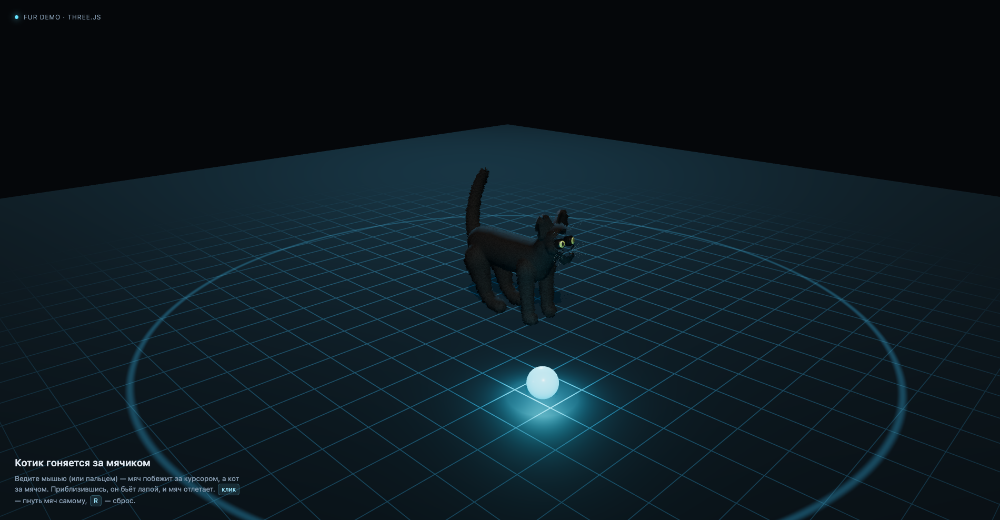

# 3D-котик 🐈‍⬛⚽

[](https://3d-cat.vercel.app)
[](https://threejs.org)
[](LICENSE)

Чёрный кот с процедурным мехом (three.js + WebGL) гоняется за мячиком, который следует
за курсором. Всё в браузере, без сборки и без CDN — three.js лежит рядом в `vendor/`.

**Живая демка: <https://3d-cat.vercel.app>**



**Что происходит на странице**

* мячик тянется за курсором как на пружине, отскакивает от пола и от края площадки;
* кот доворачивается к мячу и бежит за ним (анимация `Run`, скорость зависит от дистанции);
* догнав, бьёт лапой (клип `Swipe`) — мяч отлетает;
* когда мяч далеко отпущен, кот возвращается к `Idle` (дыхание, покачивание хвоста);
* `клик` — подтолкнуть мяч самому, `R` — сброс.

## Запуск

```bash
# любой статический сервер (ES-модули не работают с file://)
npm run dev          # python3 -m http.server 5173
# или
npx serve .
```

Открыть http://localhost:5173

## Как это устроено

| Файл | Роль |
| --- | --- |
| `index.html` | разметка + HUD + importmap (`three` → `./vendor/three.module.js`) |
| `main.js` | сцена, свет, «сцена-подиум», мяч, ИИ кота, меховой шейдер |
| `models/cat.glb` | кот: скиннед-меш + морда (23.2k трис), арматура из 15 костей, клипы `Idle`/`Run`/`Swipe` |
| `vendor/` | three.js 0.182 + `GLTFLoader` |
| `blender/` | скрипты, которыми модель сгенерирована с нуля |

### Мех

Классические **fur shells**: базовая скиннед-модель клонируется 18 раз, каждая копия
раздувается вдоль нормали на `layer * 15..17 мм`. Клоны делят один скелет (`SkinnedMesh.clone()`
копирует ссылку на `skeleton`), поэтому все слои анимируются одним `AnimationMixer`.

В шейдере (`onBeforeCompile`, без текстур):

* **vertex** — сдвиг вдоль `objectNormal` до скиннинга, поэтому мех «приклеен» к коже и
  деформируется вместе с ней; амплитуда подмешивается 3D-шумом;
* **fragment** — `discard` там, где процедурный 3D-шум (value noise, 430 + 1150 циклов/м)
  меньше «высоты» слоя. Чем выше слой, тем реже он выживает → получается ворс, а не мыльный пузырь;
* цвет: почти чёрный у корня → чуть светлее и теплее к кончикам; пиксели внутри уха
  подкрашиваются через vertex color (`COLOR_0`), записанный в Blender.

Счётчик справа внизу показывает fps и количество треугольников (≈ 350k с учётом теней при
18 слоях; на телефоне слоёв 10).

Мех растёт на 17 мм, а глаза и нос сидят глубоко в черепе, поэтому шейдер вырезает в мехе
«дырки» (юниформа `uFurHoles`): центры и радиусы берутся прямо из геометрии морды
(`collectFurHoles()` — сферы вокруг радужек и носовой кожи). Радужки обоих глаз лежат в одном
glTF-примитиве, поэтому сферы считаются не по центроиду группы (он попадал бы между глазами
и вырезал всю морду), а по связным островкам геометрии (`geometryIslands()`): одна сфера на
глаз, одна на нос, остальные кольца радужки отбрасываются как близкие к уже найденной сфере.
Маска считается по *смещённой* вершине оболочки (`vFurDisp_`), иначе ворсинки, растущие с края
глазницы, всё равно накрывали бы глаз. Нулевой слой (сама кожа) не режется никогда — иначе в
«дырках» появлялась прозрачная область и через голову было видно фон.

### Модель

`blender/web_build_cat.py` собирает кота с нуля и выгружает GLB:

1. анатомия из мета-боллов (позвоночник, лапы, хвост, голова, глазницы — негативными шарами) →
   полигонизация в меш → decimate до ~8.8k трис;
2. уши-раковины (bmesh), глаза, нос, усы;
3. арматура: `hips/chest/neck/head`, `tail1..3`, по две кости на лапу + авто-веса
   (глаза и усы жёстко на `head`);
4. запекаются клипы `Idle` (48 кадров), `Run` (20), `Swipe` (17);
5. экспорт `models/cat.glb` (~870 КБ, без текстур).

```bash
# нужен Blender 5.x в PATH
blender -b --factory-startup --python blender/web_build_cat.py
```

Фотомодель для рендеров (particle hair, Cycles) — `blender/build_cat.py`, см.
`blender/README-blender.md`.

### Глаза

В glTF не переносятся нодовые материалы, поэтому «фотомодельный» радужный градиент
(`mat_iris()` в `build_cat.py`) для веба собран из геометрии и плоских цветов:

| Часть | Что это |
| --- | --- |
| `EyeSclera` | почти чёрный глазной шар, утопленный в глазницу (позиция вдоль оси — `EYE_SINK`) |
| `EyeIrisDeep` → `EyeIris` → `EyeIrisInner` | радужка из трёх концентрических колец: тёмно-оливковое вокруг зрачка, зелёное, янтарно-жёлтое к лимбу |
| `EyeIrisOuter` | тёмный лимбальный ободок — он и делает границу радужки резкой |
| `EyePupil` | вертикальная «щель»: эллиптический кап `PUPIL_H × PUPIL_V`, а не круглая точка |
| `EyeCornea` | тонкий прозрачный купол (в GLB — alpha, transmission glTF не умеет) |
| `EyeGlint` | запечённый блик сверху-слева: в тёмной сцене он сразу оживляет взгляд |
| `CatBlack` (тор-обод) | веко: кольцо-тор закрывает щель между шаром и глазницей и читается как разрез глаза |

Кольца радужки раздаются одной сферической «шапке» (`band_cap()`: материал выбирается по
углу полигона от вершины капа), так что всё это — один меш и семь примитивов в GLB.
Общий размер глаза (шар + радужка + веко) задаёт `EYE_SCALE`; на глазницу (негативный
мета-болл радиуса 19 мм) веко-тор рассчитано так, чтобы она была закрыта целиком.

```bash
# посмотреть глаза без меха (Cycles, 900×900)
blender -b --factory-startup --python blender/render_glb_eyes.py -- models/cat.glb renders/eyes/x
```

## Деплой

Живёт на Vercel: **https://3d-cat.vercel.app** (проект `3d-cat`, аккаунт `edkhv`).

Статика, никакой сборки: Vercel отдаёт корень репозитория как есть,
`vercel.json` добавляет длинный `Cache-Control` для `models/` и `vendor/`.

```bash
npx vercel link --project 3d-cat   # один раз
npm run deploy                     # vercel --prod
```

Автодеплой по push в `main` включается в два шага:

1. GitHub → Settings → Applications → **Vercel** → Configure → Repository access →
   добавить репозиторий `3D-cat` (приложение Vercel должно его видеть);
2. в папке проекта выполнить `npx vercel git connect https://github.com/edkhv/3D-cat`.

После этого каждый push в `main` собирает продакшн, а PR-ы получают preview-URL.

## Лицензия

MIT. Модель сгенерирована скриптами из этого репозитория, three.js — MIT.
